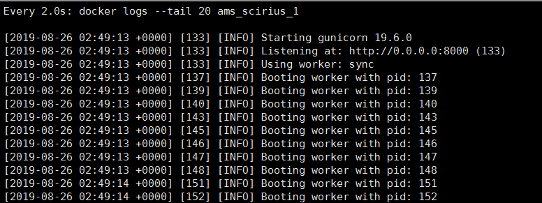
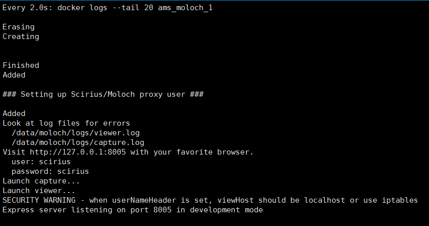
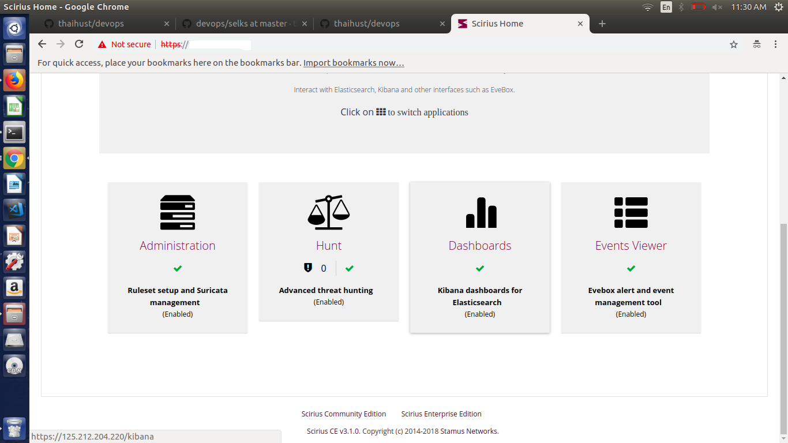
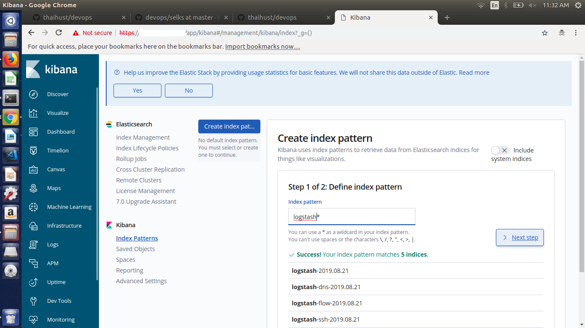
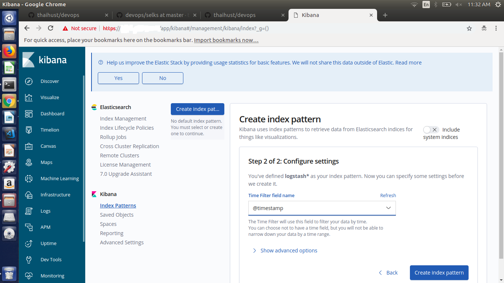
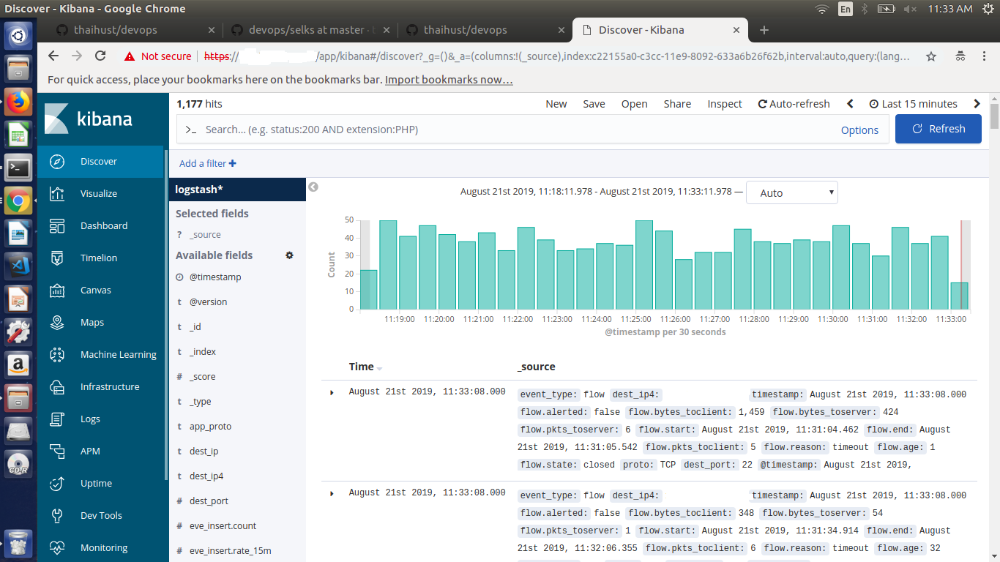

# OS supported: ubuntu 16.04, ubuntu 18.04
# Hướng dẫn build & run SELKS bằng docker
- Bước 1: Setup môi trường docker và python:

  ```
  bash 1-install-docker.sh
  bash 2-python-environment.sh
  ```

- Bước 2: Setup Amsterdam:

  ```
  cd Amsterdam
  python setup.py install
  ```

- Bước 3: Trên thư mục bất kì, generate SELKS docker-compose file và run SELKS stack:

  ```
  amsterdam -d ams -i eth0 setup
  cd ams
  docker-compose up -d
  ```

  Chú ý thay giá trị eth0 bằng card mạng mà suricata muốn sniff

- Bước 4: Kiểm tra cài đặt:
  - Sau khi các container của stack SELKS đã tạo xong, cần phải chờ một khoảng thời gian để scirius và moloch khởi động xong dịch vụ.
  - Kiểm tra trạng thái các docker containers:
   
  ```
  docker ps
  ```
  
  - Mở hai console ssh, dùng lệnh watch để theo dõi hai container scririus và moloch:
  
  ```
  watch -n 2.0 "docker logs --tail 20 ams_scirius_1"
  watch -n 2.0 "docker logs --tail 20 ams_moloch_1"
  ```
  
  - Với scirius, đợi cho tới khi có log thông báo như sau nghĩa là đã khởi tạo xong:
  
  
  
  - Với moloch, đợi cho tới khi có log thông báo như sau nghĩa là đã khởi tạo xong:
  
  

  - Bước 4 là bước khởi tạo databases và setup user cho moloch. Sau khi confirm moloch đã khởi tạo xong, phải tạo lại container moloch mới với tùy chọn không khởi tạo lại database mỗi khi restart container (tránh việc xóa đi các packets đã index trong elasticsearch):
  
  ```
  docker-compose -f moloch.yml up -d
  ```

- Bước 5: Import Elasticsearch visualization, index-pattern, dashboard, search vào stack SELKS theo mục 3 trong hướng dẫn sau: https://github.com/thaihust/devops/tree/master/selks/utilities/elasticsearch

- Bước 6: Truy cập portal scirius: https://_host ip_. Account mặc định access vào scririus: scirius/scirius

- Bước 7: Cấu hình Kibana portal:

  - Trên giao diện scirius, click vào ô Dashboard để mở Kibana dashboard: 

  

  - Trên Kibana dashboard, click vào Discover, Kibana sẽ yêu cầu tạo một Index pattern. Nhập: `logstash*` và click Next step.

  

  - Cấu hình Time Filter là: `@timestamp`. Sau đó click "Create index pattern"

  

  - Click lại vào Discover để xem log:

  

- Bước 8: Truy cập portal moloch: https://_host ip_/moloch

- Bước 9 (optional): Copy các file pcap vào thư mục: ```ams/moloch/tcpdump```. Sau đó thực hiện lệnh sau để import các file pcaps:

  ```
  docker exec -ti ams_moloch_1 bash -c '/data/moloch-parse-pcap-folder.sh'
  ```

# Cấu hình cho moloch

- Moloch không phải là realtime system, moloch chỉ ghi SPI data vào elasticsearch đối với một session sau một khoảng thời gian timeout nhất định kể từ khi session đó đóng. Do đó trong một số trường hợp, có thể mất từ 3-5 phút SPI data mới được ghi vào elasticsearch và hiển thị trên moloch portal. Moloch support cấu hình một số loại session như sau: tcp, udp, sctp, icmp (Chi tiết thông tin các tham số cấu hình: https://molo.ch/settings). Với bộ cài hiện tại (lấy ví dụ theo hướng dẫn cài đặt ở mục trên):

  - Sửa file: ```ams/config/moloch/config.ini```. Dưới section ```[default]```:

  ```
  tcpTimeout = 600
  tcpSaveTimeout = 720
  sctpTimeout = 60
  udpTimeout = 30
  icmpTimeout = 10
  ```
  
  - Restart lại moloch để áp dụng cấu hình: ```docker restart ams_moloch_1```

# Sizing tài nguyên cho node SELKS + Moloch

- __Bước 1__: Tính toán disk speed trên server chạy Moloch. Dúng lệnh sau:

```
dd bs=256k count=50000 if=/dev/zero of=/data/test oflag=direct
```

  - Chú ý:
    - Thay đường dẫn __/data__ bằng đường dẫn tới thư mục trên ổ lưu pcap. Ví dụ thư mục: __/data1__ mount ổ __/dev/vdb1__ dùng để lưu pcap -> __of=/data1/test__
    - Sau khi chạy xong lệnh này, xóa file test đi: rm -f /data/test
  
  - Thực tế đo trên VM dùng CEPH RBD: 57 MB/s
  - Theo recommend của Moloch, network throughput mà moloch có thể xử lý được mà không drop packet không vượt quá 60%-80% disk speed đo ở trên (Tham khảo: https://github.com/aol/moloch/wiki/FAQ#what-kind-of-packet-capture-speeds-can-moloch-capture-handle). Theo khuyến nghị đó, với VM test hiện tại, khả năng xử lý của Moloch (không drop packets) là: 273.6 - 364.8 Mbps.
  
- __Bước 2__: Dùng tcpreplay bắn traffic đo khả năng xử lý của Moloch:
  - Tải pcap mẫu: ```wget https://s3.amazonaws.com/tcpreplay-pcap-files/smallFlows.pcap```
  - Cài đặt tcpreplay và bmon: ```apt-get update && apt-get install -y tcpreplay bmon```
  - Dùng tcpreplay bắn pcap trên interface cần monitor: ```tcpreplay -i eth0 -l 3200 -K --mbps 310 smallFlows.pcap``` (thời gian bắn khoảng 15 phút)
  - Mở tab khác để theo dõi throughput theo thời gian thực: ```bmon -p eth0```
  - Theo dõi log của moloch: Trong thư mục cài SELKS + Moloch (Ví dụ trong tutorial này là thư mục __ams__), gõ lệnh: ```tail -f moloch/logs/capture.log```. Log này có thông tin xử lý packets và kết nối tới elasticsearch dùng để debug.
  - Chú ý:
    - Hiệu năng bắn tcpreplay với file pcap mẫu ở trên không đạt 100%. Do đó mặc dù bắn với tốc độ setting là 310 Mbps nhưng thực tế tốc độ bắn chỉ khoảng 280 Mbps (báo cáo từ summary của tcpreplay)
	
- __Bước 3__: Lấy kết quả đo
  - So sánh kết quả summary của tcpreplay và kết quả monitor throughput của bmon trong khoảng thời gian đo.
  - Thực tế đo Moloch chịu được througphut (mà không drop packets): 277 - 286 Mbps tức là khoảng 60% disk speed.
  
- __Bước 4__: Sizing:
  - Tham số của stack SELKS + Moloch:

| STT | Tham số | Ý nghĩa | Giá trị (theo bộ cài) | Ảnh hưởng |
| --- | --- | --- | --- | --- |
| 1 | maxESRequests | Số lượng requests tối đa đang được xử lý trong queue của Moloch | 1500 | Có thể tăng giá trị này để tránh bị drop request (ghi SPI data) từ moloch tới elasticsearch|
| 2 | -Xms và -Xmx | Tham số cấu hình heap size của jvm cho elasticsearch| 3072m | Tương tự như tham số đầu tiên, tham số này phải tăng lên theo throughput xử lý của Moloch để áp ứng việc index các SPI data của Moloch. Với lab test hiện tại (đáp ứng throughput 277 Mbps), yêu cầu khoảng 3GB RAM cho jvm heapsize.|
| 3 | pcapWriteSize | Buffer size moloch khi ghi pcap file | 1048576 (bytes) (phải set là bội của 4096) | Giá trị này mặc định là 262144 (256k), tuy nhiên phải tăng lên 1048576 (1024k) để giảm tốc độ ghi vào ổ cứng (tránh lỗi disk Q overflow) |
| 4 | maxPacketsInQueue | Số lượng packet tối đa mà mỗi moloch thread phải xử lý (ở trạng thái waiting) | 500000 | Giá trị mặc định là 100k, tuy nhiên phải tăng lên để tránh tình trạng bị drop packets|
| 5 | packetThreads | Số lượng thread cấp cho moloch để xử lý packets | 4 | Tăng lên tùy theo throughput xử lý của Moloch, mục đích là để giảm tình trạng drop packets hoặc Packet Q overflows |
  
  - Các file settings (nằm trong thư mục chứa scripts deploy stack SELKS + moloch, ví dụ theo tutorial này là ams):
    - config/moloch/config.ini <br>
    Restart lại moloch để áp dụng cấu hình: ```docker restart ams_moloch_1```<br>
    Chú ý sửa lại ams_moloch_1 (tên moloch container) cho phù hợp môi trường cài
    - elasticsearch.yml: chỉnh sửa các tham số memory cho elasticsearch (Xmx, Xms) dưới section của dịch vụ elasticsearch. <br>
    Với elasticsearch, để áp dụng cấu hình sau khi chỉnh sửa, chạy lại các lệnh sau:<br>
    ```
    docker rm -f -v ams_elasticsearch_1
    docker-compose -f elasticsearch.yml up -d
    ```
  - Tham số về dung lượng lưu trữ:
    - Theo kết quả đo, trong khoảng 15 phút với througput là: 277 Mbps:
      - Elasticsearch data: 1.5 GB
      - Pcap data của Moloch: 30 GB
      - Tổng cộng: 31.5 GB
    - Sizing cho một ngày: 3 TB
    - Sizing cho một tháng: 90 TB
    
  - Tham số về dung lượng RAM:
    - Tổng dung lượng RAM cấp cho stack SELKS + Moloch đáp ứng yêu cầu 277 Mbps (3GB heapsize cấu hình cho elasticsearch): 8GB (đo được vào thời điểm chạy test bắn pcap) <br>
    -> Recommend tối thiểu cho VMs chạy SELKS + moloch: 10 GB RAM (no swap)
